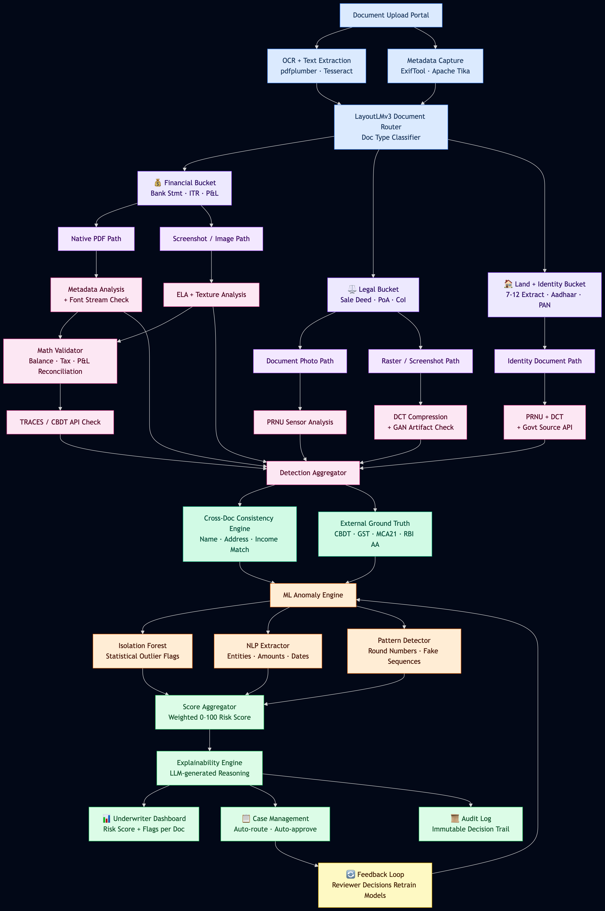

# Credexa - Document Fraud Detection for Loan Underwriting

Welcome to **Credexa**, a comprehensive solution for detecting tampering, forgery, and anomalies across land records, legal documents, and financial statements in real time. This system provides intelligent insights to support faster, more reliable decision-making during the loan underwriting process.

## 🚀 Overview

How can a bank automatically detect tampering or changes made across land records, legal documents, and financial statements in real time? Credexa solves this by offering a multi-layered pipeline that ingests documents, categorizes them, extracts forensic metadata, applies visual and logical validation, and surfaces anomalies to the underwriter with an LLM-powered explainability engine.

### Core Pipeline
1. **Ingestion**: OCR & Text/Metadata Extraction (pdfplumber, Tesseract, PaddleOCR)
2. **Document Routing**: Categorizes documents into Financial, Legal, or Land & Identity using LayoutLMv3.
3. **Forensic Analysis**:
   - **File Forensics**: Inspects PDF layers, object structure, and edit history.
   - **Visual Forensics**: Performs Error Level Analysis (ELA), DCT block analysis, and PRNU noise fingerprinting.
   - **Logical/Math Validation**: Cross-checks financial equations (e.g., Bank balance reconciliation, Assets = Liabilities + Equity).
4. **Cross-Document Consistency**: Uses NER and fuzzy matching to ensure details (Names, PAN, DOB) match across different submitted documents.
5. **ML Anomaly Engine**: Employs Isolation Forest and Pattern Detectors to flag outliers.
6. **Score Aggregation & Explainability**: Calculates a definitive risk score, and uses a local LLM (e.g., Qwen) to generate a natural-language explanation of why a document was flagged.

## 📁 Supported Document Types

Credexa is built to handle the complexities of regional and standard documents:

- **Land & Property Records**: 7/12 Extract, Property Cards, Sale Deeds, Mortgages, Encumbrance Certificates.
- **Legal & Identity Documents**: Aadhaar, PAN, Passport, MoA/AoA, Board Resolutions, Power of Attorney.
- **Financial Statements & Tax Registries**: Bank Statements, Balance Sheets, P&L, Form 16, Form 26AS, Corporate Tax Returns.

## 🏗 System Architecture

*The pipeline maps every block to a concrete open-source tool, ready for both local prototype scaling and production deployment.*

## 💻 Tech Stack & Tooling

- **OCR & Extraction**: `pdfplumber`, `Tesseract`, `PaddleOCR`
- **Metadata & Forensics**: `ExifTool`, `pikepdf`, `Pillow` (for ELA), `Imago Forensics`
- **Classification**: `LayoutLMv3`, `Donut`
- **NLP & Matching**: `spaCy`, `RapidFuzz`
- **ML & Analytics**: `scikit-learn`, `pandas`
- **Explainability**: `Ollama`, `Qwen2.5-7B`
- **UI & API**: `FastAPI`, `Streamlit` / `Next.js`

## 🛠 Build & Setup Guide

For a detailed, step-by-step implementation plan including component breakdowns, tools used, datasets for training, and deployment notes, please refer to the [Document Fraud Detection Build Guide](document-fraud-detection-build-guide.md).

## 📄 License

This project is licensed under the MIT License.
